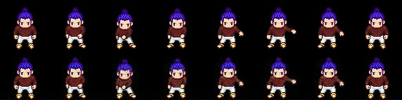
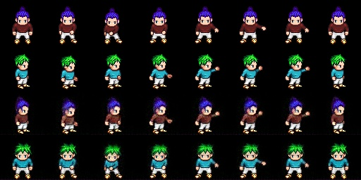

#### 简介
该模型可以实现序列数据的动态和静态的分离，实现《Disentangled Sequential Autoencoder》论文上第一个实验。

#### 类介绍
**Data：**
数据处理类，加载图片，并将图片分批返回。

**Models：**
模型类，MyTensors主要是整合多gpu训练后的变量递度，SubTensor是模型类。

**App：**
训练和预测类。

**Config：**
参数类。

**Framework：**
框架类，内有config基类、app基类和tensor基类，实现了config、app、tensor之间的关系，实现了多GPU并行训练。

#### 效果
还原效果：第一行是输入图，第二行是输出图；

随机生成静态：第一行是输入图，第二行是输出图；

特征交换：第一、二行是输入图x1、x2，第三行是x1的静态和x2的动态结合，第四行是x1的动态和x2的静态结合。

